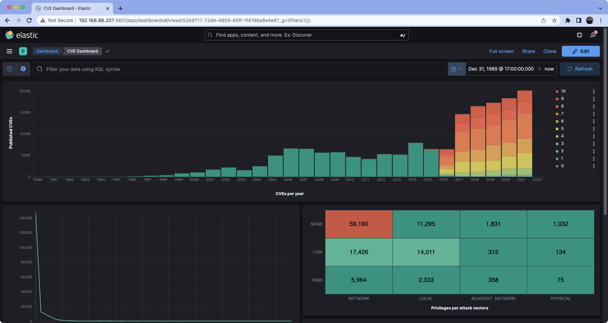

# CVElk

## About The Project

CVElk allows you to build a local [Elastic Stack](https://www.elastic.co/elastic-stack/) quickly using docker-compose 
and import data directly from [NVD](https://nvd.nist.gov/) and [EPSS](https://www.first.org/epss/).

### Built With

* [Docker-Compose](https://docs.docker.com/compose/)
* [Elastic Stack](https://www.elastic.co/guide/en/elastic-stack-get-started/master/get-started-docker.html)
* [EPSS Data](https://www.first.org/epss/)
* [NVD Data](https://nvd.nist.gov/)

## Getting Started

### Prerequisites

CVElk was built and tested on macOS 13.0 and requires the following software:

* [Docker](https://docs.docker.com/docker-for-mac/install/)
* [Minimum of 4GBs of Ram](https://docs.docker.com/docker-for-mac/)
* [Docker-Compose](https://docs.docker.com/compose/)

### Installation

1. Clone the repository

   ```sh
   git clone https://github.com/jgamblin/CVElk
   ```

2. Run the installation script.

   ```sh
   ./CVElk.sh
   ```

### Kibana Access

Once the shell script has finished running you can access the [Kibana Dashboard](http://localhost:5601/) 
at [http://localhost:5601/](http://localhost:5601/) to start exploring the data.

There is an example dashboard included in the install:


## Roadmap

* Scheduled Data Runs

## Data Notes

Depending on your internet speed and the amount of data requested, startup can take 10 minutes to more than an hour. 
By Default:

## Contributing

Contributions are what make the open source community such an amazing place to be learn, inspire, and create. Any 
contributions you make are **greatly appreciated**.

1. Fork the Project
2. Create your Feature Branch (`git checkout -b feature/AmazingFeature`)
3. Commit your Changes (`git commit -m 'Add some AmazingFeature'`)
4. Push to the Branch (`git push origin feature/AmazingFeature`)
5. Open a Pull Request

## Support

Use the [issues](https://github.com/jgamblin/CVElk/issues) tab to report any problems or issues.

## License

Distributed under the MIT License. See `LICENSE` for more information.

## Contact

Jerry Gamblin - [@jgamblin](https://twitter.com/jgamblin)
